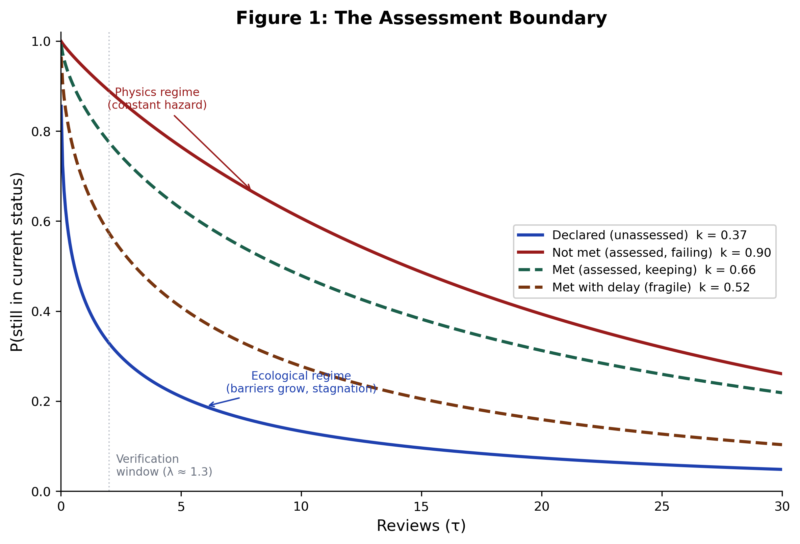

# The Verification Paradox

**How Checking Makes Commitment Networks Look Worse and Work Better**

Conor Nolan-Finkel — Pleco / Promise Pipeline
Working Paper — March 2026

## Abstract

Whether someone checks a commitment matters more than what the commitment contains. We analyze 69,847 IMF lending conditions and find that commitment dynamics split into two regimes at the moment of verification: ecological (Weibull k = 0.37, stagnation) and physics-like (k = 0.90, constant hazard). This produces a paradox: programs that verify aggressively score worse because checking surfaces failures that would otherwise remain invisible.

## Paper

- SSRN: [link TBD]
- Preprint: `verification_paradox_final.pdf` (in this directory)

## Data

All primary data is publicly available from the IMF MONA database:
https://www.imf.org/external/np/pdr/mona/

GPRA data was extracted from publicly available Annual Performance Reports from the Department of the Interior (FY 2021-2023) and the Environmental Protection Agency (FY 2024).

### Source Data Checksums

See `checksums.txt` for SHA-256 hashes of all source files used in the analysis. Download the MONA data from the link above and verify against these checksums to ensure you are working with the same source data.

## Methods Summary

### Weibull Survival Analysis

We fit Weibull survival functions to condition dwell times (consecutive reviews in a given status) using nonlinear least squares on the empirical survival curve:

P(survive to τ) = exp(−(τ/λ)^k)

- k < 1: decreasing hazard (ecological regime, barriers grow)
- k = 1: constant hazard (physics regime, memoryless)
- k > 1: increasing hazard (pressure accumulates)

Fits computed per cohort (by initial status, condition type, network regime, country, review position, and time period). Model adequacy assessed via R², Shapiro-Wilk on residuals, and Spearman correlation of residuals with dwell time.

### XGBoost Classification

- 51 features in 3 tiers: structural (9), assessment history (7), network physics (3), plus controls
- Temporal split: train pre-2019 (N=25,938), validate 2019-2021 (N=3,890), test 2022+ (N=1,757)
- Calibration: isotonic regression on validation set (Brier 0.078)
- Feature importance via gain and SHAP values

### Promise Network Construction

Each IMF arrangement modeled as a commitment network using the Promise Pipeline schema. Network-level classification via verification conductivity into conductor / semiconductor / insulator regimes.

## Key Results

| Cohort | k | λ (reviews) | N |
|---|---|---|---|
| Declared (unassessed) | 0.37 | 1.5 | 48,580 |
| Not met (assessed) | 0.90 | 21.6 | 1,510 |
| Met (assessed) | 0.66 | 15.9 | 16,937 |
| Met with delay | 0.52 | 6.2 | 2,820 |

- XGBoost AUC: 0.934 (test set)
- Health paradox: ρ = −0.242, p = 0.0002 (more verification → lower health scores)
- 91 countries: k ranges 0.17 (Turkey) to 0.87 (Togo)
- Verification window: ~2 reviews before ecological regime takes hold
- Temporal improvement: k rose from 0.30 (2012-2016) to 0.50 (2022-2026)

## Figure



## Citation

```bibtex
@article{nolanfinkel2026verification,
  title={The Verification Paradox: How Checking Makes Commitment Networks Look Worse and Work Better},
  author={Nolan-Finkel, Conor},
  year={2026},
  note={Working paper. Available at SSRN.}
}
```

## License

This paper and its supplementary materials are copyright Conor Nolan-Finkel / Pleco, 2026. The Promise Pipeline platform is licensed under AGPL-3.0.
